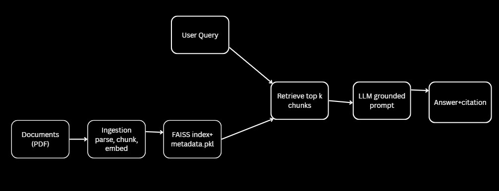
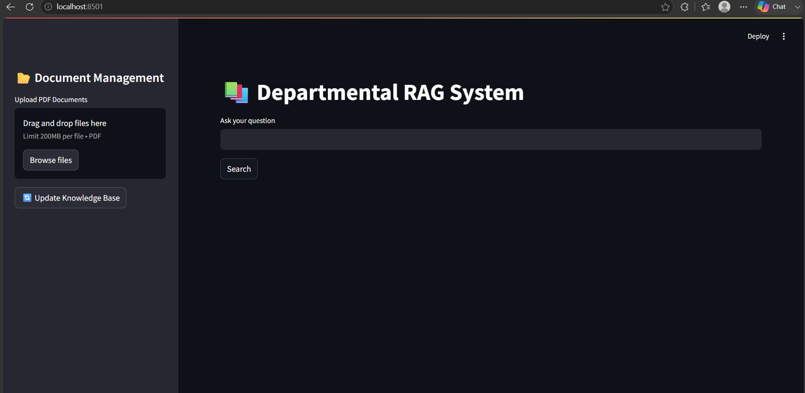
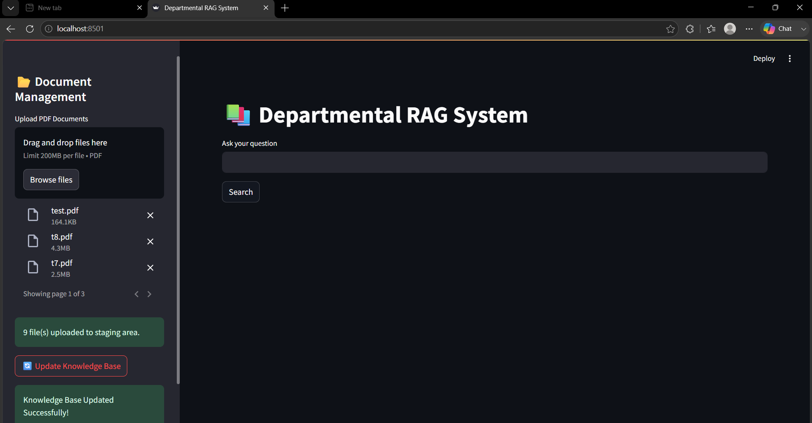
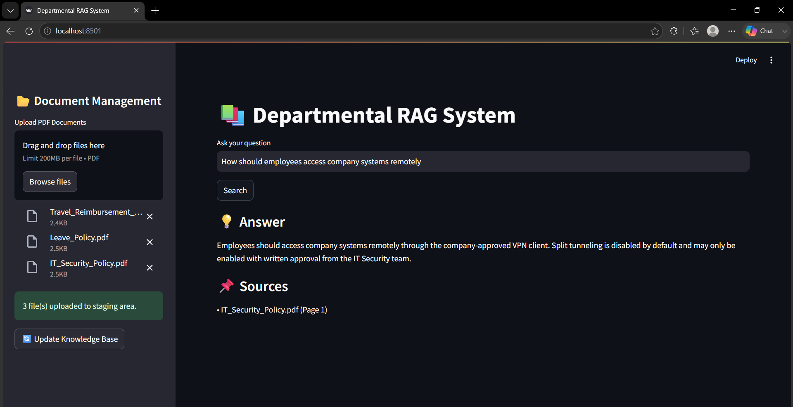
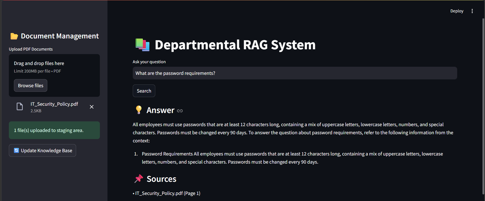
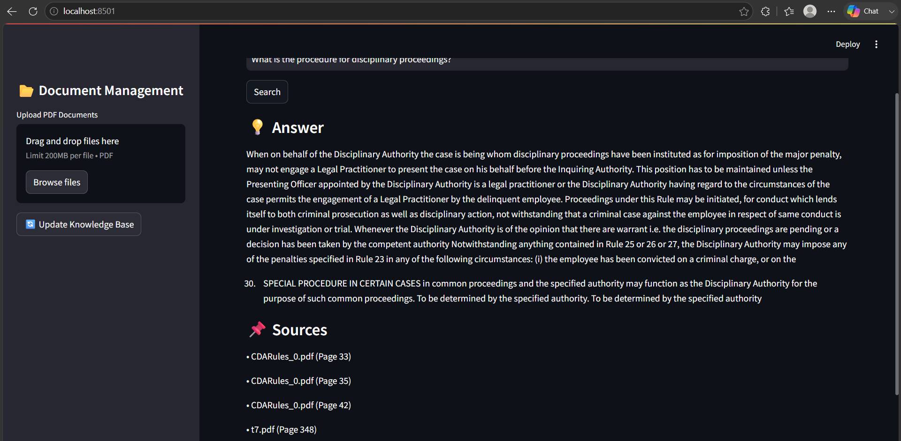
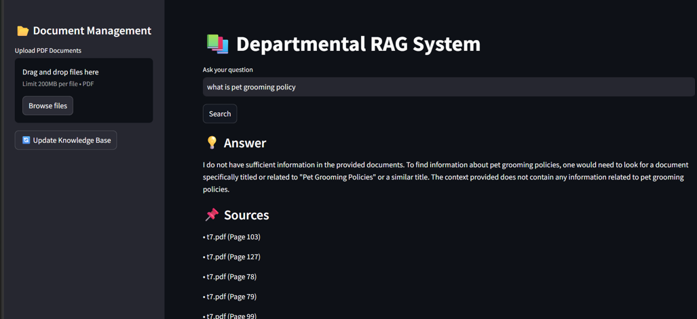

# Departmental RAG System
A fully local Retrieval-Augmented Generation (RAG) application that answers questions from departmental policy documents.
The system indexes PDF documents using semantic embeddings and FAISS, retrieves the most relevant content for a user's query, and generates grounded responses using a local Large Language Model (LLM). All inference runs locally without requiring cloud APIs.

---

## Features
- Fully local inference using Qwen2.5-3B-Instruct (GGUF)
- Semantic document retrieval using FAISS
- Embeddings generated with BAAI/bge-small-en-v1.5
- Upload PDF documents through a Streamlit interface
- Incremental indexing of newly uploaded documents
- Duplicate document detection using SHA-256 hashing
- Source citations with page numbers
- Hallucination prevention using similarity thresholding
- Automatic fallback response when information is unavailable

---


## Tech Stack
| Component | Technology |
|-----------|------------|
| Programming Language | Python |
| Frontend | Streamlit |
| LLM | Qwen2.5-3B-Instruct (GGUF) |
| LLM Engine | llama-cpp-python |
| Embedding Model | BAAI/bge-small-en-v1.5 |
| Vector Store | FAISS |
| Document Parser | PyPDF |
| Text Chunking | LangChain RecursiveCharacterTextSplitter |

---

## Architecture


---

## Files Overview


| File | Purpose |
|------|---------|
| `app.py` | Streamlit web application |
| `ingest.py` | Parses PDFs and builds the FAISS index |
| `retrieval.py` | Command-line RAG application |
| `requirements.txt` | Python dependencies |
| `vector_store/` | Stores FAISS index and metadata |
| `uploads/` | Temporary uploaded documents |
| `models/` | Local GGUF model |

---

## Project Structure

```text
RAG_PROJECT_/
│
├── data/                     # Departmental policy PDFs
├── models/                   # GGUF model (gitignored)
├── uploads/                  # Uploaded PDFs
├── vector_store/             # FAISS index and metadata (gitignored)
├── .gitignore
├── app.py                    # Streamlit web application
├── ingest.py                 # PDF ingestion and vector indexing
├── rag_llm.py                # LLM loading and configuration
├── retrieval.py              # Retrieval and question answering
├── README.md
└── requirements.txt
```

---

## Installation

## Prerequisites

- Python 3.10 or above
### Clone the repository

```bash
git clone https://github.com/JeslynMathew/Departmental-RAG-System.git
cd Departmental-RAG-System
```

### Create a virtual environment

**Windows**

```bash
python -m venv venv
venv\Scripts\activate
```


### Install dependencies

```bash
pip install -r requirements.txt
```

---

## Model Setup

Download the GGUF version of **Qwen2.5-3B-Instruct** and place it inside the `models/` directory.

```
models/
└── qwen2.5-3b-instruct-q4_0.gguf
```

> Model files are excluded from Git using `.gitignore`.

---

## Running the Application

Start the Streamlit application:

```bash
streamlit run app.py
```

The application will open automatically in the browser.

---

## Workflow

1. Upload one or more PDF documents.
2. Click **Update Knowledge Base**.
3. Documents are parsed and split into text chunks.
4. Embeddings are generated using Sentence Transformers.
5. Embeddings are stored in a FAISS vector index.
6. User questions are converted into embeddings.
7. Relevant document chunks are retrieved.
8. The retrieved context is passed to the local LLM.
9. The generated answer is displayed with source citations.

---

## Demo
### Home Page



---

### Upload Documents



---

### Question Answering

**Query**

> How should employees access company systems remotely?


---
> What are password requirements?



---
> What is the procedure for disciplinary proceedings?



---
### Hallucination Prevention

When the requested information is unavailable in the indexed documents, the system returns a predefined fallback response instead of generating unsupported information.

**Query**

> What is pet grooming policy?

**Response**

> I do not have sufficient information in the provided documents.


